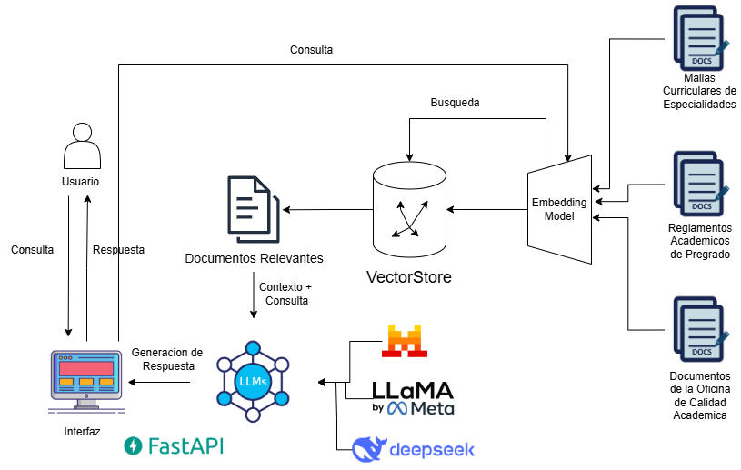
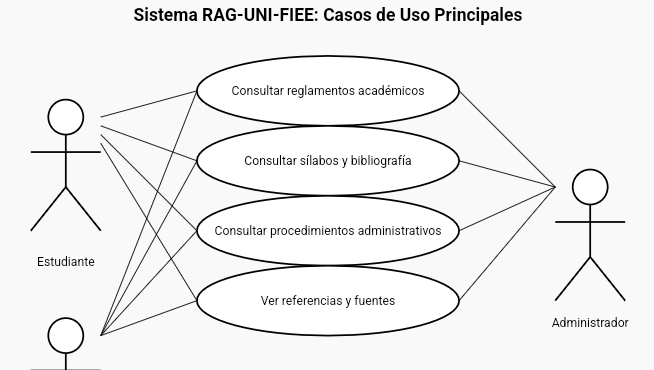

# RAG-UNI-FIEE

Repositorio del proyecto de **Recuperación de Información Aumentada (RAG)** para la Facultad de Ingeniería Eléctrica y Electrónica de la Universidad Nacional de Ingeniería (UNI).

---
## Objetivo principal:
Facilitar los procesos largos y la difusión de reglamentos mediante un chatbot interactivo que responda de forma inmediata y precisa a las dudas más comunes de los estudiantes de la FIEE.

## 🎯 Objetivos del Proyecto

1. Brindar respuestas claras sobre reglamentos y normas académicas de la FIEE (créditos, repitencia, requisitos de egreso, etc.).
2. Facilitar el acceso a información detallada sobre los cursos (syllabus, bibliografía, contenidos).
3. Automatizar la atención de consultas frecuentes mediante IA.
4. Utilizar un modelo de lenguaje (como GPT) potenciado por recuperación de documentos oficiales (RAG).
5. Construir una herramienta útil, extensible y validada para estudiantes y docentes de la FIEE.

---

## 🤖 ¿Qué es un sistema RAG?

Un sistema de **Recuperación de Información Aumentada (RAG)** combina dos tecnologías:

- **Recuperación** de documentos relevantes (PDFs, syllabus, reglamentos).
- **Generación** de respuestas usando un modelo de lenguaje (como GPT), con base en esos documentos.

Esto permite ofrecer respuestas **confiables, actualizadas y contextualizadas**, evitando "alucinaciones" del modelo.

## Arquitectura de RAG FIEE UNI

## Diagrama de Casos de Usos

